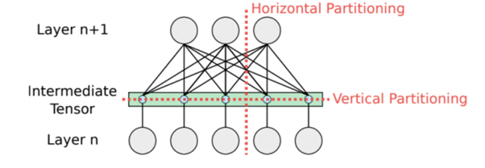
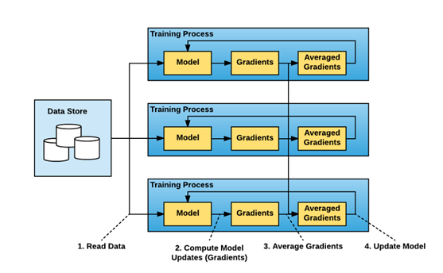
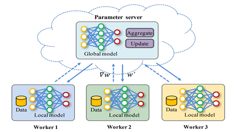
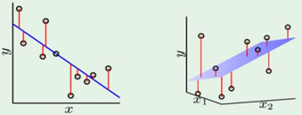
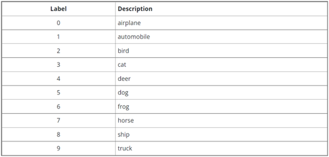

# Rain

Rain is a cutting-edge distribution framework specifically designed for AI workloads, boasting a profound ambition to democratize the field of artificial intelligence. This pioneering framework empowers individuals by granting them the ability to train their models on vast datasets, transcending the limitations imposed by resource constraints. With its diverse range of operational modes, Rain affords users the flexibility to work seamlessly on local systems, harness pre-provisioned machines, or even provision machines based on customized criteria. Notably, Rain excels in maintaining fault tolerance, unparalleled accuracy, and utmost efficiency throughout the processing pipeline.

## Table of Contents

1. [Literature Survey](#literature_survey)
2. [Deep Learning](#deep_learning)
3. [Model Parallelism](#model_parallelism)
4. [Data Parallelism](#data_parallelism)
5. [Synchronous training](#synch_training)
6. [Downpour SGD](#downpour_sgd)
7. [Asynchronous training](#async_training)
8. [Maachine Learning](#machine_learning)
9. [K-nearest neighbors (KNN) algorithm](#knn)
10. [Logistic Regression Algorithm](#logistic_regression)
11. [Linear Regression Algorithm](#linear_regression)
12. [Implemented Approach](#implemented_approach)
13. [System Testing and Verification](#system_testing)
14. [Results](#results)

## Literature Survey

Rain supports distributed machine learning and deep learning applications. The implementation of distributed ML algorithms is straightforward in some cases. However, distributed deep learning requires a strong understanding of some concepts which will be discussed extensively in this chapter. Also, a brief explanation of distributed ML algorithms will be discussed.

## Deep Learning

Usually, when faced with a gigantic task in any field, it is common practice to break it down into smaller tasks and execute them simultaneously. This approach not only saves time but also renders complex tasks manageable. In the realm of deep learning, this strategy is known as distributed training. Distributed training involves distributing the training workload of a large-scale deep-learning model across multiple processors. These processors, often referred to as worker nodes or simply workers, are trained concurrently to expedite the training process. The most commonly used techniques in distributed deep learning training are the model parallelism technique and the data parallelism technique.

## Model Parallelism

In certain exceptional circumstances, the size of the model might exceed the capacity of the memory of a computer, necessitating the utilization of model parallelism. Model parallelism, also referred to as network parallelism, involves dividing the model either horizontally or vertically into distinct sections that can be executed concurrently across multiple workers, each operating on the same data (the full training dataset). In this approach, the workers only need to synchronize the shared parameters, typically once during each forward or backward-propagation step. Vertical partitioning, which leaves the layers unaffected, can be applied to any deep learning model, making it the preferred method. Horizontal partitioning, on the other hand, is only considered when there are no alternative options to fit a layer within the memory of a single machine, which rarely happens. In some cases, model parallelism can be employed even more simply. For instance, in an encoder-decoder architecture, we can train the encoder and decoder separately using different workers. The most common use case of model parallelism technique can be found in NLP models such as transformers.

## Data Parallelism

The data parallelism technique is summarized as follows:
<ol>
    <li>There is a master node (referred to as a parameter server) which holds the global state (i.e. the weights) of the model.</li>
    <li>Divide the data into N number of partitions, where N is the total number of available workers in the computer cluster.</li>
    <li>Each worker node has a full replica (copy) of the deep learning model and each one of them performs the full training loop on its own subset of the data.</li>
    <li>The global weight updates are carried out either synchronously or asynchronously.</li>
</ol>

The data parallelism technique is best used in case the data is too large to be stored on a single machine.

In data parallelism, it is essential that the worker nodes communicate with the parameter server so that they can share the model weights.

## Synchronous training
Each worker performs the training loop (a specified number of epochs) on its data subset and computes the gradients 

$$ gradients=∇l(x,w_t) $$

i.e., it is equivalent to the partial derivative of the loss function with respect to the models’ parameters. Then the worker sends the gradients back to the parameter server and waits for the new updated model.

The parameter server waits for all the workers to send their gradients to perform the global weight update which is done as follows:

Find the average of the workers gradients: 

$$ gradients\_average=1/N  ∑_{i=1}^{i=N} workers\_gradients_i $$

Update the global weights of the model: 

$$ w_{t+1}=w_t-η*gradients\_average, \:\: where\:η\:is\:the\:learning\:rate $$

Then, the parameter server sends the new global weights to all the workers to start another training loop.

This process is repeated until the number of global weight updates done matches the specified number of iterations.

The averaging of gradients at the master node is done to apply consistent updates to the global model. It is an approximation of the true gradients that would be calculated for the entire dataset. This approximation is made under the assumption that each partition of the dataset is independent and identically distributed (i.i.d), i.e., the disjoint subsets are representative of the dataset. By using this approximation, the learning rate used in the global weight updates is the same as the one used by all the workers which are running the training loops.

Here each worker waits for all other workers to complete their training loops and calculate their respective gradients to be able to begin the next training loop. It is called synchronous because synchronization between all the workers and the master is required before starting the training loop. It is important to note that all workers produce different gradients as they are trained on different subsets of data, however at any point in time, all the workers have the exact same weights which helps to speed up the model convergence.

## Downpour SGD
Downpour SGD (Stochastic Gradient Descent) is an optimization algorithm used in machine learning and deep learning for training large-scale models. It is an extension of the standard SGD algorithm that incorporates the idea of parallelism to improve efficiency. In traditional SGD, the model parameters are updated after each individual training example, which can be computationally expensive when dealing with large datasets. Downpour SGD addresses this limitation by introducing a distributed computing framework. In the Downpour SGD algorithm, multiple workers operate in parallel, each with a copy of the model. The training data is divided into smaller subsets, and each worker independently computes the gradients based on its assigned batch. Instead of updating the model parameters after each example, the workers accumulate the gradients locally. Then, the parameter server collects the gradients from the workers, applies them to update the global model, and broadcasts the updated parameters back to the workers. This process of updating and broadcasting the parameters happens asynchronously, allowing each worker to continue training with the most recent model while the update is being propagated. The key advantage of Downpour SGD is that it enables parallelism, as multiple workers can simultaneously compute gradients on different subsets of the training data. This helps to speed up the training process for large-scale models and big datasets. It also provides fault tolerance, as workers can recover from failures without compromising the overall progress of the training.

## Asynchronous training
In the synchronous approach we are not able to use all the resources efficiently as a worker must wait for other workers in order to perform the next training loop. This is especially a problem when there is a significant difference in the computation powers among all the workers, in which case the whole training process is only as fast as the slowest worker in the cluster. The synchronization overhead becomes larger as the number of workers increases, which may degrade the training performance.

Thus, in asynchronous training, we want workers to work independently in such a way that a worker need not wait for any other worker in the cluster. This technique aims to improve the training performance by reducing the synchronization overhead while maintaining the degradation of the model accuracy as small as possible.

Initially, each worker reads the model from the parameter server.

Each training worker performs a full training loop and sends the gradients back to the parameter server which then updates the model weights.

The parameter server updates the global state of the model once it receives the gradients from any worker, the update is done using the Downpour SGD algorithm with learning rate adaptation:

$$ w_{t+1}=w_t-\dfrac{η}{(number\_of\_workers)}*gradients $$

Then, the worker that sent the gradients should be able to read the new model weights after the global weight updates.

Notice that in global weight update rule, the learning rate is divided by the number of workers, this is due to the weight update is done using the gradients of only one worker which is trained on a subset of the dataset not the full dataset which means that the learning rate should be decreased to prevent divergence of the whole training process.

The total number of global asynchronous weight updates equals the number of workers in the computer cluster multiplied by the specified number of iterations (i.e., each worker is responsible for participating in a number of global weight updates which is equivalent to the defined number of iterations).

In asynchronous training, there may be some slow workers or large network communication overhead occurring between it and the parameter server, this may lead to slower model convergence because other faster workers are using newly updated weights while the slow worker may have old weights.

<table>
    <tr>
        <th>P.O.C</th>
        <th>Synchronous Training</th>
        <th>Asynchronous Training</th>
    </tr>
    <tr>
        <td>Model convergence</td>
        <td>Fast</td>
        <td>Slow</td>
    </tr>
    <tr>
        <td>Resource utility</td>
        <td>Low</td>
        <td>High</td>
    </tr>
    <tr>
        <td>Model used in each iteration</td>
        <td>Same for all workers (updated version)</td>
        <td>Maybe different (stale or updated version)</td>
    </tr>
</table>

## Machine Learning

Machine learning algorithms can be divided into two categories: supervised learning and unsupervised learning. Supervised learning takes labeled inputs (e.g., a set of images labeled dogs and cats) and builds a model that can be used to predict future unlabeled inputs. Unsupervised learning aims to discover patterns about the data without relying on labeled instances (e.g., clustering customers into categories for market analysis).

## K-nearest neighbors (KNN) algorithm

It is a supervised machine learning algorithm used for classification tasks. It is a non-parametric algorithm, meaning it does not make any assumptions about the underlying data distribution. The KNN classifier operates based on the principle that similar instances tend to exist in close proximity to each other. It determines the class of a new, unlabeled instance by examining the class labels of its k nearest neighbors in the training dataset. The value of k is a user-defined parameter that determines the number of neighbors considered. KNN has no training phase, it is ready for prediction once the training dataset is loaded.

For one test example, it does the following:
<ul>
    <li>Calculate the distance between the test example and all other training examples using a distance function.</li>
    <li>Find the k-nearest training examples (the ones that have the least distance to the test example).</li>
    <li>Classify the test example according to the majority of the nearest neighbors.</li>
</ul>

This is a very computationally intensive operation, for this reason, a synchronous data parallelism technique is used to address this problem which is summarized as follows:
<ul>
    <li>There is a master node which is responsible for the reduction operation.</li>
    <li>Divide the data into N number of partitions, where N is the total number of available workers in the computer cluster.</li>
    <li>The test dataset is sent to all workers.</li>
</ul>

Each worker runs the sequential KNN algorithm and sends back the results to the master node. For each test example, the master node sorts the received neighbors ascendingly according to the distance and chooses the K-nearest neighbors and then classifies the example according to the majority of those neighbors.

## Logistic Regression Algorithm

It is a probabilistic classifier that outputs probabilities that decide the classification target. It is better than non-probabilistic in that the model clarifies how confident it is regarding the final classification.

Negative log-likelihood loss for a single example:

$$ e_{in}(w)=log(1+ e^{-y_i w^T x_i}) $$

The average loss for all the training examples is given by:

$$ E_{in}(w)=\dfrac{1}{M} ∑_{i=1}^{i=M} log(1+ e^{-y_i w^T x_i }) $$

To minimize this loss:

$$ ∇_w E_{in} =0 $$

$$ ∇_w E_{in} =\dfrac{1}{M}∑_{i=1}^{i=M} (\dfrac{-y_i x_i}{1+e^{y_i w^T x_i}})=0 $$

Solving the equation to obtain the optimal 𝑤 is infeasible. Hence, we won’t be able to arrive at a closed form solution.

So, we can apply the iterative gradient descent algorithm as follows:

$$ w_{t+1}=w_t- η ∇_w E_{in} =w_t- η*\dfrac{1}{M}∑_{i=1}^{i=M} (\dfrac{-y_i x_i}{1+e^{y_i w^T x_i } }) $$

To predict a new sample x:

$$ p(y=+1|x)= θ(w^T x) $$

$$ p(x)= θ(-w^T x)=1-θ(w^T x) $$

Where θ(z) is the sigmoid function:

$$ θ(z)=\dfrac{1}{1+ e^{-z}} $$

Then a threshold for this probability is set to determine the class label for the new sample.
However, the computation of the gradients 

$$ (∇_w E_{in}) $$

can be very expensive with increasing the training data size.

A synchronous data parallelism technique is used to address this problem which is summarized as follows:
<ul>
    <li>There is a master node which holds the weights of the current iteration.</li>
    <li>Divide the data into N number of partitions, where N is the total number of available workers in the computer cluster.</li>
    <li>Each worker node receives a copy of weights at the start of each iteration.</li>
</ul>

Each worker performs the following computation using its data subset:

$$ ∇_w E_{in}^{'}(w)=∑_{i=1}^{i=M^{'}} (\dfrac{-y_i x_i}{1+e^{y_i w^T x_i}}) $$

Where M' is the size of the worker’s data subset.

The worker sends those partial gradients along with the size of the data subset to the master node which perform the following computation using the results from all the workers in the cluster:

$$ M=∑_{i=1}^{i=N} M_i^{'} $$

$$ ∇_w E_{in} = \dfrac{1}{M} ∑_{i=1}^{i=N} (∇_w E_{in}^{'} (w))_{i} $$

Then, it updates the weights using the computed gradients and sends the new weights to all the workers to begin another iteration. This process is repeated for a pre-defined number of iterations.

## Linear Regression Algorithm

It is a supervised machine learning algorithm used for predicting continuous numeric values based on the relationship between the features and the target. It assumes a linear relationship between the features and the target variable. The algorithm aims to find the best-fitting line that minimizes the distance between the predicted values and the actual values in the training dataset.

Define the following matrices:

$$ X_{M * (1 + d)}= \begin{bmatrix} 1 & x_{1}^{T} \\ 1 & x_{2}^{T} \\ \vdots & \vdots \\ 1 & x_{M}^{T} \end{bmatrix} $$

$$ Y_{M * 1}= \begin{bmatrix} y_{1} \\ y_{2} \\ \vdots \\ y_{M} \end{bmatrix} $$

$$ w_{(1 + d) * 1}= \begin{bmatrix} w_{0} \\ w_{1} \\ \vdots \\ w_{d} \end{bmatrix} $$

Where d is the number of features and M is the total size of the training dataset.
The average loss (mean square error loss) for all the training examples is given by:

$$ E_in (w)=\dfrac{1}{M} ∑_{i=1}^{i=M} (w^T x_i-y_i )^2 $$

To minimize this loss:

$$ ∇_w E_{in} =0 $$

$$ ∇_w E_{in} =\dfrac{1}{M} [(A+A^T )w-2b]=0 $$

$$ w_{opt}= (A+A^T )^{-1} 2b $$

$$ Where\:A=X^T X,\:b=X^T y $$

By substitution:

$$ w_{opt}=(X^T X  )^{-1} X^T y$$

We arrived at a closed form for the optimal weights w_opt  which is a function of the training data only. Given a dataset from which we construct the constant matrices X and y finding the best hypothesis exactly is as easy as plugging in this closed-form. It’s exactly the best hypothesis because it can be shown that E_in is convex with one global minimum so 

$$ ∇_w E_{in}=0 $$

is only satisfied there.

Despite all the nice closed-form properties, if the dataset has N examples each of d dimensions, then computing 

$$ X^T X $$

takes O(d×n×d) and then inverting the resulting (1+d)×(1+d) matrix takes O(d^3) which can take a lot of time. It also takes O(dn) memory complexity (due to X which has the size of the whole dataset)

<ul>
    <li>Thus, computing the closed-form is not always possible when dimensionality and/or the dataset size are too large.</li>
    <li>One more problem is that the inverse computation can suffer from numerical instability issues if the matrix X is sparse (has many zeros due to some features taking that value for most training examples) since computing the inverse involves dividing by the determinant.</li>
</ul>

Conclusively, numerical methods such as gradient descent can be alternatively used to minimize E_in.

Weight update equation for one iteration:

$$ w_{t+1}=w_t- η ∇_w E_{in} =w_t- η*\dfrac{1}{M} [(A+A^T ) w_t-2b] $$

However, this is a computationally intensive operation due to the size of the matrix A and vector b (their size increases by increasing the size of the training dataset).

for this reason, a synchronous data parallelism technique is used to address this problem which is summarized as follows:

<ul>
    <li>There is a master node which holds the weights of the current iteration.</li>
    <li>Divide the data into N number of partitions, where N is the total number of available workers in the computer cluster.</li>
    <li>Each worker node receives a copy of weights at the start of each iteration.</li>
</ul>

Each worker performs the following computation using its data subset:

$$ ∇_w E_{in}^{'} (w)=\dfrac{1}{M^{'}} [(A+A^T ) w_t-2b] $$

Where M' is the size of the worker’s data subset.

The worker sends those partial gradients to the master node which averages these partial gradients to obtain the gradients to be used in the global weight update:

$$ ∇_w E_{in}=\dfrac{1}{N} ∑_{i=1}^{i=N} (∇_w E_{in}^{'} (w))_i $$

Then, it updates the weights using the gradients average.

$$ w_{t+1}=w_t- η ∇_w E_{in} $$

Then, it sends the new weights to all the workers to begin another iteration. This process is repeated for a predefined number of iterations.

## Implemented Approach
Regarding deep learning, we implemented the data parallelism technique with one master node (parameter server) because it is a very common situation that the training dataset doesn’t fit in one machine. While huge models that can’t fit in one machine are most probably associated with a huge training dataset that can’t fit in one machine as well. So, huge training dataset is a very common problem in most of the AI problems currently.

Also, we implemented synchronous training and asynchronous training for deep learning training. We proposed a middle-ground scheme named semi-asynchronous training which combines the advantages of both synchronous and asynchronous training (fast model convergence and high resource utility). It performs asynchronous updates but it doesn’t permit a worker to be ahead of other workers in terms of global updates that this worker participated in by a specified threshold (number of updates). This is done to ensure that if a worker is very slow and there are others that are relatively faster, the fast workers don't wait too long waiting for the slow worker (as in synchronous training) and the model convergence doesn’t become very slow (as in asynchronous training).

Regarding machine learning, we implemented the mentioned data parallelism technique with one master node. Also, we implemented the synchronous training for all the implemented algorithms because the asynchronous is not suitable for most of these algorithms.

## System Testing and Verification

### Machine Learning

Breast cancer dataset: It is a tabular dataset of 569 records and 30 numerical features and binary labels (used in classification).

California housing dataset: It is a tabular dataset of 20640 records and 8 numerical features and a continuous target variable (used in regression).

Logistic Regression: We used the breast cancer dataset split into 80% training and 20% testing sets. Then, we applied the sequential and distributed algorithms implemented in Rain and logistic regression implemented in Sklearn. The two models of Rain produced the same accuracy with the same prediction for each example in the test set. But the accuracy of the Sklearn model is a bit higher because the implementation is different (the used optimization algorithms in Sklearn don’t include the standard gradient descent that we implemented in Rain).

K-nearest neighbors: We used the breast cancer dataset split into 80% training and 20% testing sets. Then, we applied the sequential algorithm implemented in Rain and the KNN algorithm implemented in Sklearn. The two models produced the same accuracy and exactly the same prediction for each example in the test set.

Linear regression: We used the california housing dataset split into 80% training and 20% testing sets. Then, we applied the sequential and distributed algorithms implemented in Rain and linear regression implemented in Sklearn. The three models produced very close MSE (mean square error) and R-squared scores. This is due to the distributed synchronous algorithm updates the weights using an approximate of the true gradients.

### Deep Learning

MNIST dataset: This is a dataset of 60,000 28x28 grayscale images of handwritten 10 digits (from 0 to 9), along with a test set of 10,000 images.

CIFAR10 dataset: This is a dataset of 50,000 32x32 colored (RGB) training images and 10,000 test images, labeled in 10 categories as follows:

We developed different CNN models written in tensorflow and pytorch for both datasets and trained these models in sequential and distributed schemes and evaluated the models using the accuracy metric. The accuracies of the model trained in distributed schemes (sync, semi-async, and async) are very close to the accuracy of the model trained in the sequential scheme (and sometimes even better than it).

## Results

### Machine learning

Logistic regression (LR):

Breast cancer dataset:

<table><tr><th>Model</th><th>Accuracy</th></tr><tr><td>Sklearn LR</td><td>96.49%</td></tr><tr><td>Rain sequential LR</td><td>91.23%</td></tr><tr><td>Rain distributed LR</td><td>91.23%</td></tr></table>

The predictions of all the models of Rain are exactly the same.

K-nearest neighbor (KNN):

Breast cancer dataset:

<table><tr><th>Model</th><th>Accuracy</th></tr><tr><td>Sklearn KNN</td><td>88.6%</td></tr><tr><td>Rain sequential KNN</td><td>88.6%</td></tr></table>

The predictions of the models are exactly the same.

Linear regression (LRG):

California housing dataset:

<table><tr><th>Model</th><th>MSE</th><th>R^2</th></tr><tr><td>Sklearn LRG</td><td>0.53</td><td>0.61</td></tr><tr><td>Rain sequential LRG</td><td>0.53</td><td>0.60</td></tr><tr><td>Rain distributed LRG</td><td>0.58</td><td>0.57</td></tr></table>

### Deep Learning

MNIST CNN tensorflow model:

<table><tr><th>Model</th><th>Accuracy</th></tr><tr><td>Sequential</td><td>98.2%</td></tr><tr><td>Sync</td><td>98.1%</td></tr><tr><td>Async</td><td>97.9%</td></tr><tr><td>Semi-async</td><td>97.9%</td></tr></table>

MNIST CNN pytorch model:

<table><tr><th>Model</th><th>Accuracy</th></tr><tr><td>Sequential</td><td>97.2%</td></tr><tr><td>Sync</td><td>97.1%</td></tr><tr><td>Async</td><td>96.7%</td></tr><tr><td>Semi-async</td><td>97%</td></tr></table>

CIFAR10 CNN tensorflow model:

<table><tr><th>Model</th><th>Accuracy</th></tr><tr><td>Sequential</td><td>79.9%</td></tr><tr><td>Sync</td><td>78.8%</td></tr><tr><td>Async</td><td>78.2%</td></tr><tr><td>Semi-async</td><td>78.3%</td></tr></table>